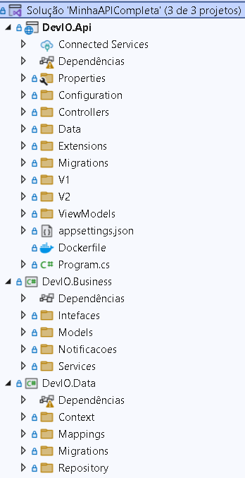

# REST com ASP.NET Core WebAPI 

## 📝️ Escopo do Projeto

Nós temos uma entidade de negógio chamado fornecedor, ela está implementada na camada de negócio,
possui regras, validações e tudo mais. Também possui um serviço para fornecedor, essa entidade
representa tambem uma tabela fornecedor no banco de dados como uma tabela.


## 🛠️ Construído com

* [Visual Studio 2022](https://learn.microsoft.com/pt-br/visualstudio/windows/?view=vs-2022) - Ferramenta de desenvolvimento, que permite realizar todo o ciclo de desenvolvimento em um só lugar.
  
## 📚 Principais Bibliotecas, Frameworks e Comandos do NuGet Utilizados

* [net6.0](https://learn.microsoft.com/pt-br/dotnet/core/whats-new/dotnet-6) - Versão da plataforma de desenvolvimento .NET, que é de código aberto e multiplataforma, desenvolvida pela Microsoft.

```
dotnet add package Microsoft.NET.Sdk.Web --version 6.0.0
```

* [AutoMapper]() - 

```
11.0.0
```

* [Swashbuckle]() - 

```
6.3.0
```

* [FluentValidation]() - 

```
10.3.6
```

* [Microsoft.EntityFrameworkCore]() - 

```
6.0.3
```

## 🚧 Descrição da Estrutura do Projeto

A estrutura do projeto segundo a imagem abaixo é composta da seguinte forma:



## ⚠️ Atenção

Destinado exclusivamente para fins de estudo.

---
⌨️ por [Byron Doria](https://gist.github.com/lohhans) 😊
